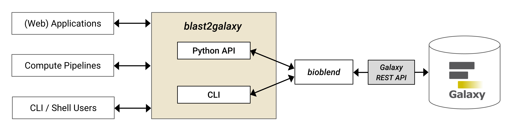

# Welcome to blast2galaxy documentation

blast2galaxy provides a Python API and CLI to perform BLAST and DIAMOND queries against Galaxy servers that have the NCBI BLAST+ tools [[1]](#1) and DIAMOND [[2]](#2) installed.

blast2galaxy is available as a PyPI package (pip) and tested to be working with the following Python versions: 3.10, 3.11, 3.12

<!--<small>*Figure 1: blast2galaxy provides a high-level convenience layer between any Galaxy server with NCBI BLAST+ tools and/or DIAMOND installed and different types of clients and usage scenarios. Researchers, applications and computational pipelines can either use the Python-API or the CLI of blast2galaxy to send requests for a BLAST search to any compatible Galaxy server. The use of BLAST+ tools and/or DIAMOND by multiple applications and the provision of corresponding BLAST databases can be centralized and made reusable by use of a Galaxy server.*</small>-->

Please read the [CLI Reference](cli.md) if you want to use blast2galaxy on the command line as drop-in replacement for NCBI BLAST+ tools or DIAMOND
or read the [API Reference](api.md) if you want to use blast2galaxy inside a Python application to perform BLAST or DIAMOND queries against a Galaxy server.

<h2>References</h2>

<a id="1">[1]</a> Peter J. A. Cock, John M. Chilton, Björn Grüning, James E. Johnson, Nicola Soranzo, NCBI BLAST+ integrated into Galaxy, GigaScience, Volume 4, Issue 1, December 2015, s13742-015-0080-7, [https://doi.org/10.1186/s13742-015-0080-7](https://doi.org/10.1186/s13742-015-0080-7)

<a id="2">[2]</a> Buchfink, B., Reuter, K. & Drost, HG. Sensitive protein alignments at tree-of-life scale using DIAMOND. Nat Methods 18, 366–368 (2021). [https://doi.org/10.1038/s41592-021-01101-x](https://doi.org/10.1038/s41592-021-01101-x)