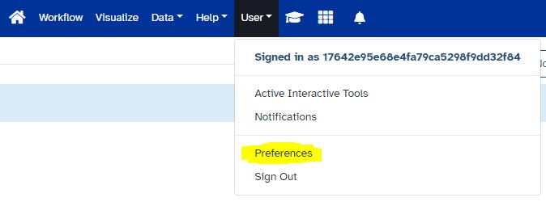
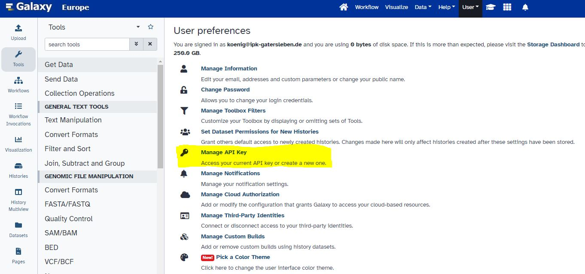
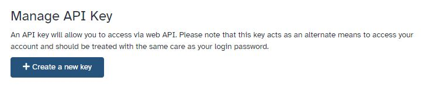
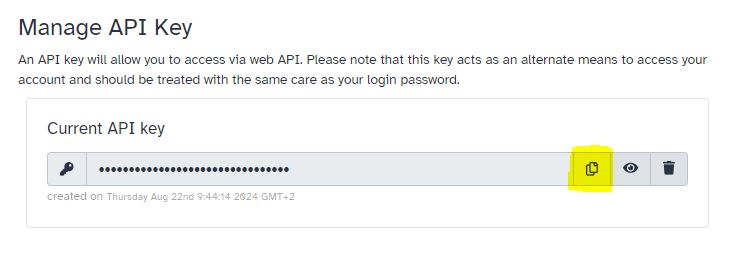
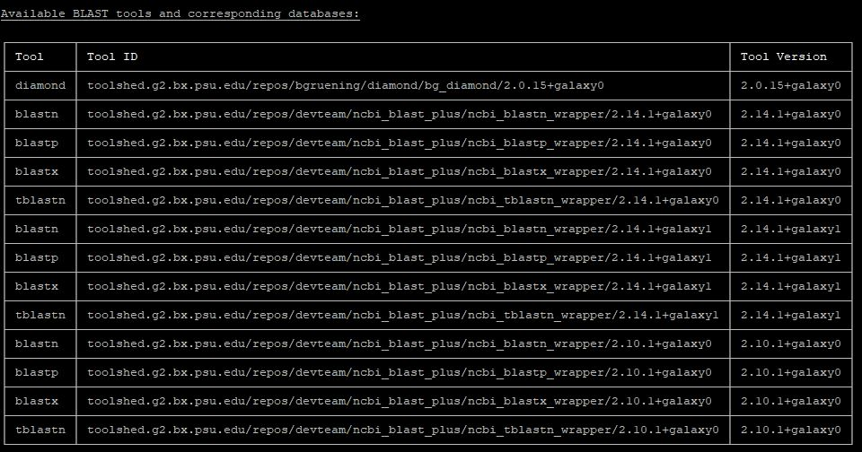
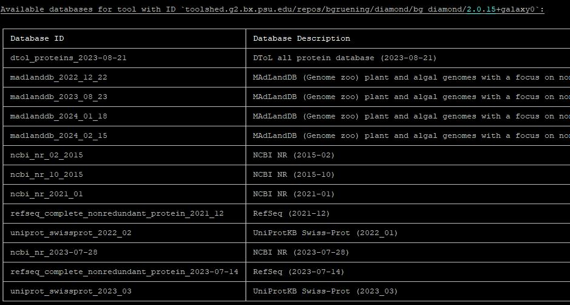

# Tutorial

This tutorial described all process from installation to performing a BLAST search on the usegalaxy.eu instance.

<h2>Prerequisites</h2>

- Python version has to be >= 3.10

## 1. Obtaining API key from usegalaxy.eu

1. Login into your account at [usegalaxy.eu](https://usegalaxy.eu/). If you don't have an account yet you can create one using LifeScience Login or the registration.
<br /><br />

2. After login into your account: In the main menu at the top of the page: click on `User` and in the appearing sub menu on `Preferences`: 
<br /><br />

3. On the then appearing `User Preferences` page click on `Manage API Key`:
   
<br /><br />

4. On the then appearing `Manage API Key` page click on the button `Create a new key`:
   
<br /><br />

4. Click on the `Copy Key` button to copy your newly created API key into your clipboard.
   

5. Please paste the API key into an editor for later usage.


## 2. Installation of blast2galaxy

Install blast2galaxy by using the following command.

!!! note
    It is highly recommended to install blast2galaxy in an isolated environment created with an environment management tool like conda/mamba, pixi, virtualenv or similar.

!!! tip
    It is also possible to install blast2galaxy via conda/mamba from the BioConda channel. This is explained in the [Installation section](installation.md#installation-with-mamba-or-conda).

```
pip install blast2galaxy
```

After installation you can check if the blast2galaxy CLI is available by executing the following command:

```
blast2galaxy --help
```

You should then see some help information about the blast2galaxy CLI:

```
Usage: blast2galaxy [OPTIONS] COMMAND [ARGS]...

  Main entrypoint.

Options:
  --help  Show this message and exit.

Commands:
  blastn
  blastp
  blastx
  diamond-blastp
  diamond-blastx
  list-tools
  show-config
  tblastn
```


## 3. Configuration of blast2galaxy

To configure blast2galaxy it is needed to create a config file named `.blast2galaxy.toml` in your home directory or in the current working directory where you execute blast2galaxy.

Lets create a config file in your home directory:

```
touch ~/.blast2galaxy.toml
```

You can now add the usegalaxy.eu Server as default server by pasting the following content to the config file.
Please replace `PASTE_YOUR_API_KEY_HERE` with the API key you created and stored previously.

```
[servers.default]
server_url = "https://usegalaxy.eu"
api_key = "PASTE_YOUR_API_KEY_HERE"
```

After this initial configuration you can use the following command to get a list of compatible BLAST and DIAMOND tools available on usegalaxy.eu:

```
blast2galaxy list-tools
```

The output of this command should look similar to this:



You can use this information to configure a default profile for blast2galaxy.

To do this add the following content to your existing `.blast2galaxy.toml` config file:

```
[profiles.default]
server = "default"
tool = "toolshed.g2.bx.psu.edu/repos/bgruening/diamond/bg_diamond/2.0.15+galaxy0"
```

## 4. Obtaining available sequence databases for a BLAST or DIAMOND tool

Once you have configured a default server in the `.blast2galaxy.toml` config file you can get a list of available sequence databases for a specific tool.

For this tutorial we want to list all databases for the DIAMOND tool with the ID `toolshed.g2.bx.psu.edu/repos/bgruening/diamond/bg_diamond/2.0.15+galaxy0`:
```
blast2galaxy list-dbs --tool=toolshed.g2.bx.psu.edu/repos/bgruening/diamond/bg_diamond/2.0.15+galaxy0
```

The output of this command should look similar to this:



For the example search request in step 5 we will use the database with ID `uniprot_swissprot_2023_03`.


## 5. Executing search requests

In the previous steps you have configured a default server and a default profile for blast2galaxy.
The default profile points to the DIAMOND tool on usegalaxy.eu.
Therefore you can now execute DIAMOND searches on usegalaxy.eu:

1. Create an example FASTA file called `query_protein.fasta` with a protein sequence to be searched with DIAMOND on usegalaxy.eu:
    ```
    >sp|P62805|H4_HUMAN Histone H4 OS=Homo sapiens OX=9606 GN=H4C1 PE=1 SV=2
    MSGRGKGGKGLGKGGAKRHRKVLRDNIQGITKPAIRRLARRGGVKRISGLIYEETRGVLK
    VFLENVIRDAVTYTEHAKRKTVTAMDVVYALKRQGRTLYGFGG
    ```

2. Execute DIAMOND search with blast2galaxy:
    ```
    blast2galaxy diamond-blastp --query=query_protein.fasta --db=uniprot_swissprot_2023_03 --out=result_diamond_query_protein.txt --outfmt=6
    ```

3. Check the result of the DIAMOND search:
   ```
   less result_diamond_query_protein.txt
   ```
   The result file should contain a search result similar to the following content:
   ```
   sp|P62805|H4_HUMAN      sp|P62803|H4_BOVIN      100     103     0       0       1       103     1       103     5.60e-66        196
   sp|P62805|H4_HUMAN      sp|P62800|H4_CAIMO      100     103     0       0       1       103     1       103     5.60e-66        196
   sp|P62805|H4_HUMAN      sp|Q7KQD1|H4_CHAVR      100     103     0       0       1       103     1       103     5.60e-66        196
   sp|P62805|H4_HUMAN      sp|P62801|H4_CHICK      100     103     0       0       1       103     1       103     5.60e-66        196
   sp|P62805|H4_HUMAN      sp|Q4R362|H4_MACFA      100     103     0       0       1       103     1       103     5.60e-66        196
   ...
   ```